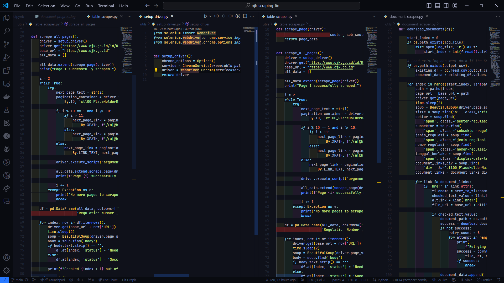
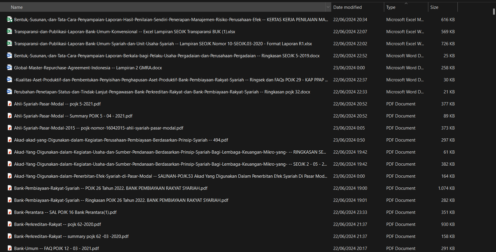

# Scraping POJK (https://ojk.go.id/)

Scraping data from POJK

## Requirements

1. Retrieve PDFs from OJK website: Regulasi (ojk.go.id) . Each regulation may have more than 1 PDFs: Naskah Peraturan, Abstrak & FAQ. 

2. Create an excel/csv to log/track the compliances: 
    - Compliance No
    - Year of regulation
    - Sector/Subsector (if available)
    - tracking & log the progress (scraped or not)

## Folder Structure

```
├── chromedriver.exe
├── data
│   ├── **.pdf
│   ├── **.docx
│   ├── **.xlsm
│   └── **.xlsx
├── log
│   ├── download_progress.log
│   ├── ojk_document_result.csv
│   └── ojk_table_scraping_result.csv
├── main.py
├── notebook.ipynb
├── requirements.txt
└── utils
    ├── document_scraper.py
    ├── setup_driver.py
    └── table_scraper.py
```

## How to run

```
cd <path_to_repository>
pip install -r requirements.txt
python main.py
```

## Documentation

1. Code Preview


2. Regulation Table Scraping Result


3. Document Tracer


4. Downloaded File in Local


## Contributors
1. Abraham Megantoro Samudra
2. Ahmad Rizki
