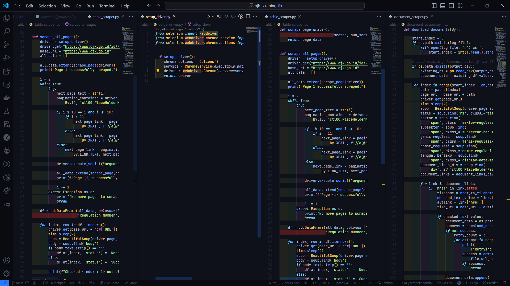
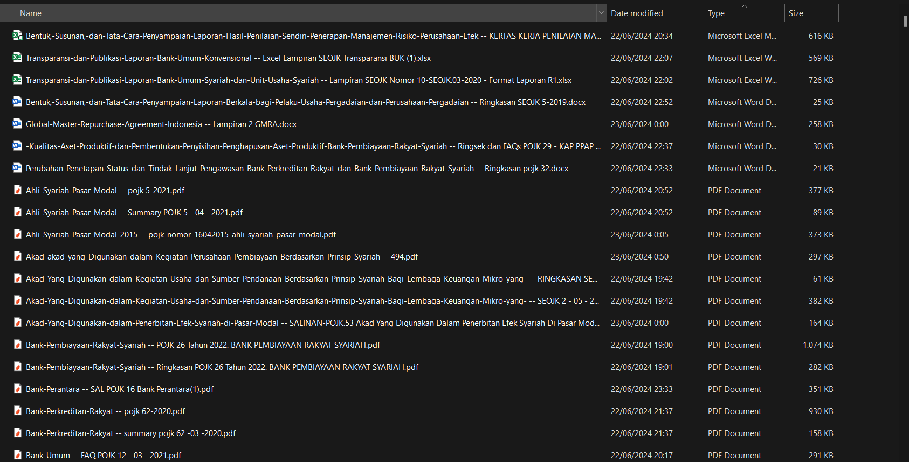

# Scraping POJK (https://ojk.go.id/)

Scraping data from POJK

## Objectives

1. Retrieve PDFs from OJK website: Regulasi (ojk.go.id) . Each regulation may have more than 1 PDFs: Naskah Peraturan, Abstrak & FAQ. 

2. Create an excel/csv to log/track the compliances: 
    - Compliance No
    - Year of regulation
    - Sector/Subsector (if available)
    - tracking & log the progress (scraped or not)

3. Name Standardization: 
```
ojk-<regulation_type>-<regulation_no>-<year>-<title>.<ext>
```
- Example of the file name: 
```
ojk-klasifikasi_bapepam-36_pmk_010_2008-26022008-peraturan_menteri_keuangan_nomor_36_pmk_010_2008_tentang_besar_santunan_dan_sumbangan_wajib_dana_kecelakaan_lalu_lintas_jalan.pdf
```

## How to run
1. Download chromedriver.exe from this url and install in the root direcotry
```
https://googlechromelabs.github.io/chrome-for-testing/
```
2. Download [Data](https://drive.google.com/file/d/1VDX8MgyRVXNVGcB-plpaSoEcPGqUUqIw/view?usp=sharing) and extract in the root directory

3. Run this command

```
cd <path_to_repository>
pip install -r requirements.txt
python main.py
```

## Folder Structure

```
├── chromedriver.exe
├── data
│   ├── *.pdf
│   ├── *.docx
│   ├── *.xlsm
│   └── *.xlsx
├── data_sanitized
│   ├── *.pdf
│   ├── *.docx
│   ├── *.xlsm
│   └── *.xlsx
├── documentation
│   └── *.png
├── log
│   ├── download_progress.log
│   ├── filename_sanitizer.log
│   ├── ojk_document_sanitizing_result.csv
│   ├── ojk_document_result.csv
│   └── ojk_table_scraping_result.csv
├── main.py
├── notebook.ipynb
├── requirements.txt
└── utils
    ├── document_scraper.py
    ├── filename_sanitizer.py
    ├── setup_driver.py
    └── table_scraper.py
```


## Documentation

1. Code Preview
<center>

</center>

2. Regulation Table Scraping Result
<center>

</center>

3. Document Tracer
<center>

</center>

4. Sanitized Document Tracer
<center>

</center>

5. Downloaded File in Local
<center>

</center>

6. Sanitized File in Local
<center>

</center>

## Contributors
1. Abraham Megantoro Samudra
2. Ahmad Rizki
